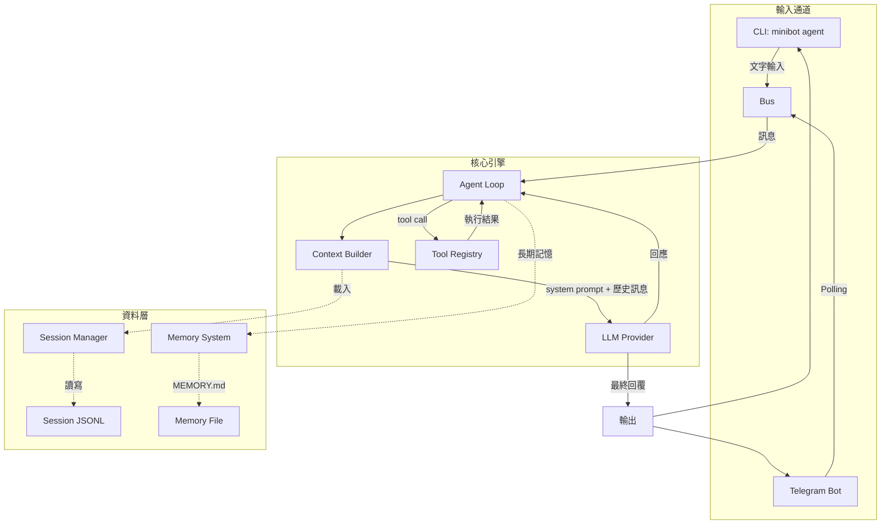

# 🤖 mini_bot

✨ MVP 最小可執行性產品（Minimum Viable Product）的 Personal AI Agent，基於 LiteLLM 支援多種 LLM Provider。🚀

## 🌟 特色

- 🤖 **CLI 互動聊天**（`minibot agent`）
- 📱 **Telegram Bot**（`minibot telegram`）
- 💾 **Session 持久化**（JSONL 格式）
- 🧠 **長期記憶**（MEMORY.md）
- 🔧 **基本工具**：讀/寫/列目錄
- ⚡ **非同步 Agent Loop**

## 🏗️ 系統架構

> 📦 **預覽須知**：本圖使用 Mermaid 語法繪製。若在 VS Code 中看不到圖示，
> 請安裝擴充套件 [Markdown Preview Mermaid Support](https://marketplace.visualstudio.com/items?itemName=bierner.markdown-mermaid)
> （搜尋 `bierner.markdown-mermaid`）後，重新開啟 Markdown Preview 即可正常顯示。



### 模組說明

| 模組 | 檔案 | 說明 |
|------|------|------|
| CLI | `cli/commands.py` | 命令列互動介面 |
| Telegram | `channels/telegram.py` | Telegram Bot Polling |
| Agent Loop | `agent/loop.py` | 核心 Agent 迴圈 |
| Context | `agent/context.py` | 對話上下文建構 |
| LLM Provider | `providers/litellm_provider.py` | LiteLLM 整合 |
| Tool Registry | `agent/tools/registry.py` | 工具註冊與執行 |
| Session Manager | `session/manager.py` | 對話歷史持久化 |
| Memory | `agent/memory.py` | 長期記憶系統 |

## 🚀 快速開始

### 1. 🛠️ 環境準備 (以 macOS 為例)

```bash
# 安裝 pyenv 並設定 Python 3.11.9
brew install pyenv
pyenv install 3.11.9
pyenv local 3.11.9

# 確認版本
python3 --version
```

### 1.1 🪟 Windows 環境準備 (PowerShell 7)

> **⚠️ 重要**：Windows 環境必須使用 **PowerShell 7** (`pwsh`)，請勿使用 CMD 或舊版 PowerShell (v5.1)。

```powershell
# 安裝 PowerShell 7 (若尚未安裝)
# 方法一：使用 winget (Windows 10/11)
winget install Microsoft.PowerShell

# 方法二：使用 Chocolatey
choco install powershell-core

# 安裝完成後，開啟 PowerShell 7 (pwsh)

# 安裝 Python 3.11
# 方法一：使用 pyenv-win
pip install pyenv-win
pyenv install 3.11.9
pyenv local 3.11.9

# 方法二：直接從 python.org 下載 Python 3.11

# 確認版本
python --version
```

### 1.2 🐧 WSL 環境準備（Ubuntu/Debian）

```bash
# 安裝 zsh（推薦）與必備工具
sudo apt update && sudo apt install -y zsh curl wget git python3 python3-pip python3-venv

# 設定 Python 3.11
sudo apt install -y python3.11 python3.11-venv python3.11-dev
pyenv install 3.11.9
pyenv local 3.11.9

# 確認版本
python3 --version

# 安裝 Oh My Zsh（可選 but 推薦）
sh -c "$(curl -fsSL https://raw.githubusercontent.com/ohmyzsh/ohmyzsh/master/tools/install.sh)"

# 推薦外掛：歷史搜尋 + 自動補全
# 在 ~/.zshrc 中添加以下內容（需在 source $ZSH/oh-my-zsh.sh 之前）：
plugins=(git z sudo history-substring-search)

# 歷史記錄與自動補全配置（添加在 source $ZSH/oh-my-zsh.sh 之前）
HISTSIZE=10000
SAVEHIST=10000
setopt SHARE_HISTORY
setopt HIST_IGNORE_ALL_DUPS
setopt HIST_FIND_NO_DUPS
autoload -Uz compinit
compinit
```

> **💡 WSL 注意事項**：
> - 執行 Windows 原生程式（如 `code`, `explorer`）需使用 `/mnt/c/...` 路徑
> - 若要呼叫 Windows 執行檔，可將 PATH 加入 `.zshrc`
> - Telegram Bot 在 WSL 環境執行方式與 Linux 相同

### 2. ⚙️ 安裝與設定

```bash
# 安裝 minibot (開發模式)
# Linux/macOS/WSL
python3 -m pip install -e .

# Windows (PowerShell 7)
python -m pip install -e .

# 初始化設定資料夾 (~/.minibot)
# 如果是第一次執行，請先手動建立資料夾並複製設定
# Linux/macOS/WSL
mkdir -p ~/.minibot
cp config.example.json ~/.minibot/config.json

# Windows (PowerShell 7)
New-Item -ItemType Directory -Force -Path ~/.minibot
Copy-Item config.example.json ~/.minibot/config.json

# 執行系統初始化 (建立 workspace 等)
minibot onboard

# 編輯 API Key (支援開源模型或各大 Provider)
# macOS 使用 open -e, Linux/WSL 使用 nano/vim/code
code ~/.minibot/config.json
# 或
nano ~/.minibot/config.json

# Windows 使用 notepad 或 code
notepad $HOME/.minibot/config.json
# 或
code $HOME/.minibot/config.json

# 初始化 Workspace 範本
# Linux/macOS/WSL
cp workspace/AGENTS.md.example workspace/AGENTS.md
mkdir -p workspace/memory
cp workspace/memory/MEMORY.md.example workspace/memory/MEMORY.md

# Windows (PowerShell 7)
Copy-Item workspace/AGENTS.md.example workspace/AGENTS.md
New-Item -ItemType Directory -Force -Path workspace/memory
Copy-Item workspace/memory/MEMORY.md.example workspace/memory/MEMORY.md
```

### 3. 🔥 開始使用

```bash
# 啟動 CLI 互動模式
minibot agent

# 或是直接下指令
minibot agent -m "你好，請幫我列出目前目錄下的檔案"

# 查看系統狀態與設定
minibot status

# 顯示所有設定值（除錯用）
minibot config-show
```

### 🌍 多語系

支援英文、繁體中文、簡體中文。設定優先順序：config.json > 環境變數 > 預設

**方式一：透過 config.json**
```json
{
  "locale": "zh_TW"
}
```

**方式二：透過環境變數**
```bash
# 英文（預設）
export MINIBOT_LOCALE=en

# 繁體中文
export MINIBOT_LOCALE=zh_TW

# 簡體中文
export MINIBOT_LOCALE=zh_CN
```

### 🧪 測試

```bash
# 執行單元測試
python -m pytest tests/ -v

# 測試 i18n 切換
python -c "from minibot.i18n import t, set_locale, init; init(); print('EN:', t('cli.agent.welcome', version='1.0')); set_locale('zh_TW'); print('TW:', t('cli.agent.welcome', version='1.0'))"
```


## 📝 設定說明（`~/.minibot/config.json`）

完整參數說明：

```json
{
  "locale": "zh_TW",
  "providers": {
    "minimax": {
      "apiKey": "← 替換成你的 API Key",
      "apiBase": "https://api.minimax.io/v1"
    },
    "openrouter": { "apiKey": "", "apiBase": "" },
    "anthropic": { "apiKey": "", "apiBase": "" },
    "openai": { "apiKey": "", "apiBase": "" },
    "deepseek": { "apiKey": "", "apiBase": "" },
    "gemini": { "apiKey": "", "apiBase": "" }
  },
  "channels": {
    "telegram": {
      "botToken": "← 填入 Telegram Bot Token（可選）"
    }
  },
  "agents": {
    "defaults": {
      "model": "minimax/MiniMax-M2.5",
      "workspace": "~/.minibot/workspace",
      "max_tokens": 8192,
      "temperature": 0.7,
      "max_tool_iterations": 20,
      "memory_window": 50
    }
  }
}
```

### 參數說明

| 參數 | 類型 | 預設 | 說明 |
|------|------|------|------|
| `locale` | string | `en` | 語系：`en`、`zh_TW`、`zh_CN` |
| `model` | string | `minimax/MiniMax-M2.5` | LLM 模型名稱 |
| `workspace` | stringminibot/ | `~/.workspace` | 工作目錄路徑 |
| `max_tokens` | int | 8192 | 單次回應最大 token 數 |
| `temperature` | float | 0.7 | LLM 隨機性（0-2） |
| `max_tool_iterations` | int | 20 | Agent 最多 Tool 呼叫次數 |
| `memory_window` | int | 50 | 對話歷史保留訊息數 |

> - 🌐 `locale` 設定優先順序：config.json > 環境變數 > 預設
> - 🔑 API Key 可至 [minimax.io](https://www.minimax.io/) 或其他 Provider 申請
> - 💬 Telegram Bot Token 可透過 [@BotFather](https://t.me/BotFather) 申請

## 📱 Telegram Bot

設定好 `botToken` 後，執行：

```bash
# Linux/macOS/WSL
minibot telegram

# Windows (PowerShell 7)
minibot telegram
```

在 Telegram 傳訊息給你的 Bot 即可開始聊天，每個使用者會有獨立的 Session 記憶。🌈

## 📊 功能總覽

### ✅ 已實現

| 功能 | 說明 |
|---|---|
| **💬 CLI 互動聊天** | `minibot agent` 互動模式 / `minibot agent -m` 單次模式 |
| **📱 Telegram Bot** | `minibot telegram` 啟動 Polling，每位使用者獨立 Session |
| **📡 LLM 呼叫** | 透過 LiteLLM 支援 6 個 Provider，預設 MiniMax M2.5 |
| **🔁 Agent Loop** | LLM ↔ Tool 迭代迴圈（最多 20 輪） |
| **📂 檔案工具** | `read_file`、`write_file`、`list_dir` |
| **💻 Shell 工具** | `shell` — 讓 Agent 能執行系統指令 |
| **💾 Session 持久化** | JSONL 格式，自動載入歷史對話 |
| **🧠 記憶系統** | `MEMORY.md` 長期記憶 + `HISTORY.md` 歷史日誌 |
| **⚙️ 設定系統** | Pydantic schema，`~/.minibot/config.json`（repo 外，安全） |
| **📡 狀態監控** | `minibot status` 顯示設定、Provider、Telegram 狀態 |

### 🔮 未來擴展

| 功能 | 說明 |
|---|---|
| 🌐 Web 工具 | `web_search`、`web_fetch` — 讓 Agent 能上網搜尋 |
| 📚 記憶自動整合 | 自動將對話摘要寫入 MEMORY.md |
| ⏰ Cron 排程 | 定時任務 |
| 🛠️ MCP 支援 | 外部工具伺服器 |
| 📢 更多頻道 | Discord、Slack 等 |

## 📡 支援的 Provider（優先順序）

1. **MiniMax**（預設）
2. OpenRouter
3. Anthropic
4. OpenAI
5. DeepSeek
6. Gemini

## 🏗️ 專案結構

詳見 [MINIBOT_MINIMAL_VERSION.md](MINIBOT_MINIMAL_VERSION.md)

## 📏 程式碼量統計 (極簡約定)

本專案旨在維持極簡的 Agent 核心框架。你隨時可以用以下指令追蹤目前的 `minibot` 套件 `.py` 檔案總行數：

```bash
# 統計總行數 (Linux/macOS)
find minibot -name "*.py" -type f | xargs wc -l | tail -1

# 列出各檔案行數排行榜
find minibot -name "*.py" -type f -exec wc -l {} + | sort -rn | head -20
```

```powershell
# 統計總行數 (PowerShell/Windows)
(Get-ChildItem -Recurse -File -Filter *.py minibot | Get-Content | Measure-Object -Line).Lines

# 列出各檔案行數排行榜
Get-ChildItem -Recurse -File -Filter *.py minibot | Select-Object FullName | ForEach-Object { $lines = (Get-Content $_.FullName | Measure-Object -Line).Lines; [PSCustomObject]@{ File=$_.FullName.Replace((Get-Location).Path + "\", ""); Lines=$lines } } | Sort-Object Lines -Descending | Format-Table -AutoSize
```

> **📊 截至 2026-02-28：核心程式碼約為 978 行**

<!-- [😸SAM] -->